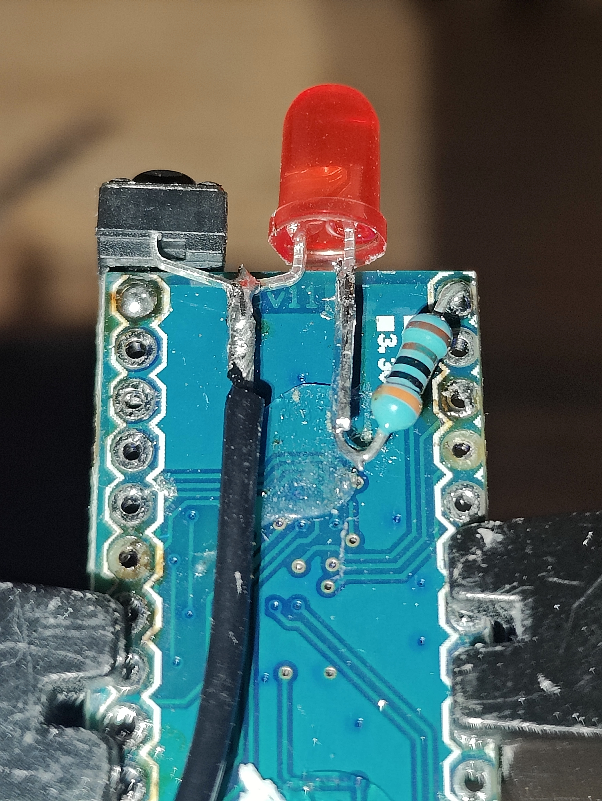

# ESP-ProMicro-HidKey

A multi-secret HID keyboard emulator for Arduino Pro Micro Leonardo (ATmega32U4) that triggers passwords or other text payloads via USB keyboard emulation using button press sequences.

## Overview

This project implements a sequence-based secret launcher on microcontroller hardware. Different combinations of short and long button presses unlock and transmit distinct payloads through USB keyboard emulation. Payloads can be simple passwords or multiline text such as ASCII-armored GPG private keys.

## Features

- **Sequence-Based Activation**: Multiple password combinations triggered by button press patterns
  - Short press (< 500ms) = `0` | Long press (≥ 500ms) = `1`
- **Encrypted Secret Storage**:
  - **Build-Time Encryption**: AES-128-CBC with per-secret random IV
  - **Runtime Decryption**: Entries are decrypted directly from flash immediately before USB typing
- **Multiline Secret Support**: Supports escaped newlines and file-based import for ASCII-armored GPG private keys
- **Persistent Brute-Force Protection**: Survives power cycles and device resets
- **Memory Security**: Multi-pass buffer clearing and automatic crypto context zeroing
- **LED Feedback**: Real-time status indicators for user actions
- **Configuration Management**: Simple `.env` file configuration (auto-generated if missing)
- **No Plaintext Storage**: Secrets never appear in generated headers as plaintext

## Getting Started

### Requirements

#### Hardware

| Component               | Quantity | Notes / Purpose                       | Approx. Price (USD) |
|-------------------------|---------|----------------------------------------|------------------|
| ATmega32U4              | 1       | Main microcontroller                   | $5 - $10 (can be much cheaper in bulk or via AliExpress)         |
| LED diode               | 1       | Status indicator                       | $0.10 - $0.50 (bulk packs or leftover components can be cheaper) |
| Resistor  220Ω - 3KΩ    | 1       | Current limiting for LED               | $0.05 - $0.10 (often <$0.01 in bulk or from leftovers)           |
| Push button             | 1       | User input                             | $0.20 - $1 (cheaper via AliExpress or bulk packs)                |
| Heat shrink tube        | 1       | Insulation and cable protection        | $0.10 - $0.50 (bulk rolls are more cost-effective)               |
| Wire pieces / cable|    |         | For connections between components     | $0.05 - $0.50 (often free from leftover wires or bulk rolls)     |

**Notes:**  
- Buying in higher quantities or using leftover/recycled parts can drastically reduce cost.  
- AliExpress and similar suppliers usually offer significantly lower prices, especially for microcontrollers and common components.  
- Total cost for a single prototype: ~$6 - $13, but can drop below $5 per unit when sourcing smartly.  


#### Wiring

```
Pro Micro Pin    Component
─────────────    ─────────────────────────────────
GND              Button (first terminal)
Pin 9            Button (second terminal)
Pin 10           LED anode (+) via 220Ω - 3kΩ resistor
GND              LED cathode (-)
```



> *Note: This is an example image showing an older ATmega Pro Micro board — it may look a little rough. Newer boards may look different.*
>
> *After soldering, secure exposed contacts with hot glue or UV resin, and fully enclose the board in heat-shrink tubing or a 3D-printed case.*
>


**Pin Configuration:**
- Button input: Pin 9 (with internal pullup)
- LED output: Pin 10

#### Software

- **Python** 3.6+ with `pycryptodomex` library
- **arduino-cli** (for building and flashing)
- **SparkFun AVR board support** (installed via arduino-cli)

### Installation

**1. Install Python Dependencies (Debian/Ubuntu/Kali):**
```bash
sudo apt install python3-pycryptodomex
```

Or via pip:
```bash
pip3 install pycryptodomex --user
```

**2. Install arduino-cli:**

Linux/macOS:
```bash
curl -fsSL https://raw.githubusercontent.com/arduino/arduino-cli/master/install.sh | sh
```

Or via package manager:
```bash
# Debian/Ubuntu
sudo apt install arduino-cli

# macOS
brew install arduino-cli
```

**3. Clone Repository:**
```bash
git clone https://github.com/arn-c0de/ESP-ProMicro-HidKey
cd ESP-ProMicro-HidKey
```

## Configuration

### Setting Up Your Environment

**1. Create Configuration File:**
```bash
cp .env.example .env
nano .env  # or your preferred editor
```

**2. Generate AES Master Key:**
```bash
python3 -c "import secrets; print(secrets.token_hex(16))"
# Output example: a7b3c9d2e8f41a6b5c7e9f2d4a8c1b3e
```

**3. Configure `.env` File:**
```ini
# AES-128 Master Key (32 hex characters = 16 bytes)
AES_MASTER_KEY=a7b3c9d2e8f41a6b5c7e9f2d4a8c1b3e

# Secret combinations
COMBINATION_COUNT=3

COMBINATION_0_SEQUENCE="0,0,1,0"
COMBINATION_0_TYPE="text"
COMBINATION_0_PASSWORD="admin123"

COMBINATION_1_SEQUENCE="1,0,0"
COMBINATION_1_TYPE="text"
COMBINATION_1_SECRET="user456"

COMBINATION_2_SEQUENCE="0,1,1,0,1"
COMBINATION_2_TYPE="gpg-private-key"
COMBINATION_2_GPG_PRIVATE_KEY_FILE="./secrets/private-message-key.asc"
```

**Sequence Format:**
- `0` = Short button press (< 500ms)
- `1` = Long button press (≥ 500ms)
- Maximum sequence length: 20 presses
- Separate presses with commas

**Example:** Sequence `"0,0,1,0"` represents:
1. Short press
2. Short press
3. Long press
4. Short press

### Building and Flashing

**1. Connect Pro Micro via USB**

**2. Build and Upload:**
```bash
./build.sh [port]
```

The build script automatically:
- Generates `embedded_passwords.h` from `.env`
- Compiles the sketch
- Uploads to the device

**Default Port:** `/dev/ttyACM0`

**Custom Port Example:**
```bash
./build.sh /dev/ttyACM1
```

🔁 **Optional: Reset EEPROM before uploading**
The `--reset-eeprom` flag (short `-r`) clears the device's EEPROM state, including the persistent brute-force counter. This is useful if you want a clean state before flashing.

Examples:
```bash
# Reset EEPROM and upload (default port /dev/ttyACM0)
./build.sh -r

# Reset EEPROM and upload to specific port
./build.sh /dev/ttyACM1 -r
```

Notes:
- The reset step is optional and safe for normal updates.
- It clears persistent EEPROM state such as the failed-attempt counter.

**Upload Troubleshooting:**
If upload fails, enter bootloader mode:
1. Press the reset button on Pro Micro twice quickly
2. Run `./build.sh` immediately (within 8 seconds)

### Basic Operation

After flashing:
1. Connect the Pro Micro to your target computer
2. Enter the configured button sequence
3. The password is automatically typed via USB keyboard emulation
4. 3-second timeout resets the sequence if no input is received

## LED Status Indicators

| LED Pattern | Meaning |
|---|---|
| 4 quick blinks | Password matched and transmitted successfully |
| Solid 2-second glow | Invalid sequence or no match found |
| 10 rapid blinks | Brute-force lockout activated |
| 2 quick blinks (startup) | Device ready (stage-2 encryption initialized) |

## Security Architecture

This project implements a **two-stage encryption system** to minimize attack surface while providing device-unique protection for each deployed instance.

### Two-Stage Encryption

#### Stage 1: Build-Time Encryption (Python)

Executed during the build process to protect secrets before firmware deployment:

- Secrets encrypted with **AES-128-CBC** (PKCS#7 padding) using the master key from `.env`
- A cryptographically random 16-byte IV generated per password and prepended to ciphertext
- Encrypted data marked with flag `0x01` and embedded in firmware (`embedded_passwords.h`)
- Master key stored in PROGMEM (flash memory)

#### Runtime Secret Handling

Executed when a valid button sequence is entered:

- The matching entry is read from PROGMEM
- The IV and ciphertext are decrypted in RAM using the AES master key
- The resulting bytes are typed over USB keyboard emulation
- Multiline secrets use real line breaks, which allows clean output of ASCII-armored GPG private keys

### Security Benefits

| Aspect | Benefit |
|---|---|
| **Cryptographic Strength** | CBC prevents block-pattern leakage and each secret gets its own IV |
| **Operational Simplicity** | No second encrypted copy in EEPROM is required for large multiline payloads |
| **Persistent Storage** | Plaintext only briefly exists in RAM during processing and is immediately cleared |

### Memory Security Practices

- Secrets stored encrypted in flash
- Plaintext only decrypted into RAM during keyboard transmission
- RAM buffers cleared via 3-pass overwrite (0xFF → 0xAA → 0x00)
- AES contexts zeroed after use
- Plaintext secrets never in generated headers

### Persistent Brute-Force Protection

- Failed attempt counter stored in EEPROM
- **Survives power cycles and device resets**
- Threshold: Maximum 5 failed attempts
- Lockout duration: 30 seconds
- Counter only resets on successful password entry
- No bypass via simple reset

### Threat Model and Limitations

#### Protected Against
- ✅ Firmware extraction alone (stage-2 requires EEPROM)
- ✅ USB replay attacks via keyboard sniffing
- ✅ Timing attacks on sequence matching
- ✅ Brute-force bypass via device reset
- ✅ RAM recovery from powered-off device

#### Not Protected Against
- ❌ Combined flash + EEPROM physical extraction
- ❌ Sophisticated hardware attacks (power analysis, fault injection)
- ❌ Physical coercion

#### Design Principles

This device relies on:
1. **Physical Security**: Secure storage/location
2. **Knowledge Factor**: Memorized button sequences
3. **Possession Factor**: Device ownership

**⚠️ Warning:** The ATmega32U4 lacks hardware security features:
- No secure boot mechanism
- No flash/EEPROM read protection
- No trusted execution environment
- Side-channel attacks (power analysis, timing) possible with specialized equipment

**Recommendations:**
- Use only in physically secure environments
- Treat a stolen device as fully compromised
- Do not use for critical high-security applications
- Consider device as two-factor authentication complement (possession + sequence knowledge)
- For critical applications: implement additional tamper detection or destruction mechanisms

## Troubleshooting

### Upload Fails

**Problem:** Sketch does not upload to device

**Solutions:**
1. Manually trigger bootloader: Press reset button twice quickly
2. Immediately run `./build.sh` (within 8 seconds)
3. Verify serial port: `ls /dev/ttyACM*` or `ls /dev/ttyUSB*`
4. Grant user permissions: `sudo usermod -a -G dialout $USER` (then logout/login)

### Compilation Fails

**Problem:** Build script reports compilation errors

**Solutions:**
1. Verify arduino-cli: `arduino-cli version`
2. Check Python version: `python3 --version` (requires 3.6+)
3. Validate `.env` exists: `test -f .env || echo "Missing .env"`
4. Check `.env` syntax (no spaces around `=`, proper quotes)

### Port Not Found

**Solutions by Platform:**
- **Linux**: Usually `/dev/ttyACM0` or `/dev/ttyACM1`
- **macOS**: Use tab completion with `/dev/cu.usbmodem*`
- **Windows**: Check Device Manager; typically `COM3` or `COM4`

List all ports:
```bash
# Linux
ls /dev/ttyUSB* /dev/ttyACM* 2>/dev/null

# macOS
ls /dev/cu.* 2>/dev/null
```

### Configuration File Missing

**Solution:**
```bash
cp .env.example .env
# Edit .env with your settings
nano .env
```

## Project Structure

```
ESP-ProMicro-HidKey/
├── ESP-ProMicro-HidKey.ino      # Main Arduino sketch
├── aes.h                         # AES-128-CBC implementation
├── chacha20.h                    # Legacy file from earlier storage design
├── sha256.h                      # Legacy file from earlier storage design
├── embedded_passwords.h          # Auto-generated encrypted secrets
├── generate_password_header.py   # Secret encryption generator
├── build.sh                      # Build and flash automation script
├── build_config.h                # Compile-time configuration
├── .env                          # Your secret configuration (gitignored)
├── .env.example                  # Example configuration template
├── .gitignore                    # Git ignore rules
├── README.md                     # This file
├── SECURITY_UPGRADE.md           # Security implementation details
└── LICENSE                       # Project license
```

### Key Files

| File | Purpose |
|---|---|
| `ESP-ProMicro-HidKey.ino` | Main application logic, sequence matching, LED control |
| `aes.h` | AES-128-CBC encryption/decryption |
| `generate_password_header.py` | Reads `.env`, encrypts secrets, generates headers |
| `build.sh` | Orchestrates build process, password generation, upload |

## Customization

### Timing Configuration

Edit timing constants in `ESP-ProMicro-HidKey.ino`:

```cpp
#define LONG_PRESS_MS 500       // Long press threshold (milliseconds)
#define TIMEOUT_MS 3000         // Sequence timeout (milliseconds)
#define MAX_FAILED_ATTEMPTS 5   // Failed attempts before lockout
#define LOCKOUT_MS 30000        // Lockout duration (milliseconds)
#define MAX_SEQUENCE_LENGTH 20  // Maximum button presses per sequence
```

### Pin Configuration

Change hardware pins in `ESP-ProMicro-HidKey.ino`:

```cpp
#define LED_PIN 10       // LED output pin
#define BUTTON_PIN 9     // Button input pin
```

### Adding More Passwords

**Without recompilation:**
1. Update `.env`: increment `COMBINATION_COUNT`
2. Add new entries:
   ```ini
   COMBINATION_3_SEQUENCE="1,1,0"
   COMBINATION_3_TYPE="text"
   COMBINATION_3_PASSWORD="newpassword123"
   ```
3. Run `./build.sh` to regenerate headers and upload

## Technical Details

### Memory Usage

- **Flash**: ~9-10KB (sketch + encrypted secrets)
- **SRAM**: ~300 bytes global, plus temporary plaintext buffer during active output
- **EEPROM**: minimal persistent state for brute-force protection
- **ATmega32U4 Specs**: 32KB flash, 2.5KB SRAM, 1KB EEPROM

### Password Storage Architecture

**Encrypted entry in flash:**
```
[Flag: 0x01] [IV: 16 bytes] [AES-CBC ciphertext: variable length]
```

**Runtime Processing:**
1. Only the active secret is decrypted into SRAM
2. Plaintext transmitted to USB
3. Buffer immediately cleared via 3-pass overwrite

### Sequence Matching

Uses constant-time bitwise XOR accumulation to prevent timing attacks that could leak partial sequence matches through execution time measurements.

### Multiline Secret Handling

ASCII-armored GPG private keys can be imported from files or from inline `.env` values using escaped `\n`. During generation the input is normalized to Unix line endings, and GPG-key entries receive a trailing newline automatically so the typed output preserves the expected armor format.

## Development Guide

### Modifying Application Logic

1. Edit `ESP-ProMicro-HidKey.ino` for behavior changes
2. Recompile and upload: `./build.sh`
3. No `.env` changes required for logic modifications

### Changing Passwords

No code changes needed:
1. Update `.env` with new credentials or secret files
2. Run `./build.sh` to regenerate encryption and upload

### Build Process

The `build.sh` script orchestrates:
1. Validates `.env` configuration
2. Runs `generate_password_header.py` to encrypt configured secrets
3. Compiles Arduino sketch with `arduino-cli`
4. Uploads firmware to connected device

### Python Generator Script

The `generate_password_header.py` script:
- Reads and validates `.env` configuration
- Validates sequence format (0/1 only, max 20 presses)
- Generates cryptographically random IVs
- Encrypts each secret with **AES-128-CBC**
- Supports inline text, escaped multiline content, and file-backed GPG key input
- Marks entries with encryption flag `0x01`
- Outputs C header file with embedded encrypted data
- Runs automatically during build

## Limitations

| Limitation | Details |
|---|---|
| **Sequence Length** | Maximum 20 button presses per combination |
| **Password Length** | Maximum 63 characters (64-byte buffer) |
| **Sequence Prefix Matching** | If one sequence is a prefix of another (e.g., "0,1" and "0,1,0"), the shorter one triggers first |
| **Hardware Security** | ATmega32U4 lacks secure boot, flash protection, or trusted execution environment |
| **Blocking LED** | LED animations block button input during display |
| **Button Debouncing** | Basic software-only debouncing; no hardware filtering |
| **Microcontroller Scope** | Designed for ATmega32U4; modifications needed for other platforms |

## Known Issues and Roadmap

### Potential Improvements

- [ ] Non-blocking LED state machine (allows button input during animations)
- [ ] Hardware button debouncing circuit
- [ ] Multiple button support
- [ ] Exponential backoff for brute-force attempts
- [ ] Display integration for visual feedback
- [ ] EEPROM wear leveling for counter persistence
- [ ] Modular code structure (separate compilation units)
- [ ] Alternative input methods (capacitive touch, etc.)

## Support and Contributions

### Reporting Issues

Please provide:
- Device specifications (Arduino Pro Micro variant, USB interface)
- Exact error messages and output
- `.env` configuration (without sensitive passwords)
- Operating system and relevant version numbers
- Steps to reproduce the issue

### Contributing

Contributions are welcome. Please:
1. Test thoroughly on actual hardware before submitting
2. Follow existing code style and conventions
3. Update documentation and comments
4. Consider security implications of changes
5. Add tests or validation where applicable

## License

[Specify your project license here]

## Disclaimer

This project is provided **as-is** for educational and personal use. The authors and contributors assume no responsibility for:
- Security breaches or data exposure
- Device malfunction or hardware damage
- Loss of access to credentials or systems
- Misuse of the device

**Use at your own risk.** This device is not suitable for protecting critical authentication credentials or high-security applications. Treat a compromised or stolen device as fully compromised.

## Security References

For more information about cryptographic implementations and security practices:
- [NIST SP 800-38A: Block Cipher Modes](https://nvlpubs.nist.gov/nistpubs/Legacy/SP/nistspecialpublication800-38a.pdf) (AES-CBC)

See [SECURITY_UPGRADE.md](SECURITY_UPGRADE.md) for detailed encryption architecture documentation.
